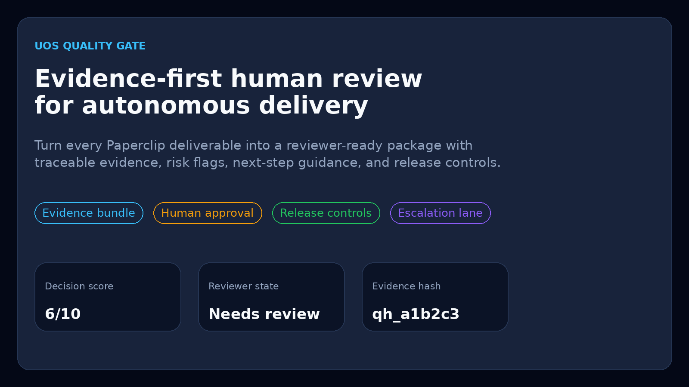
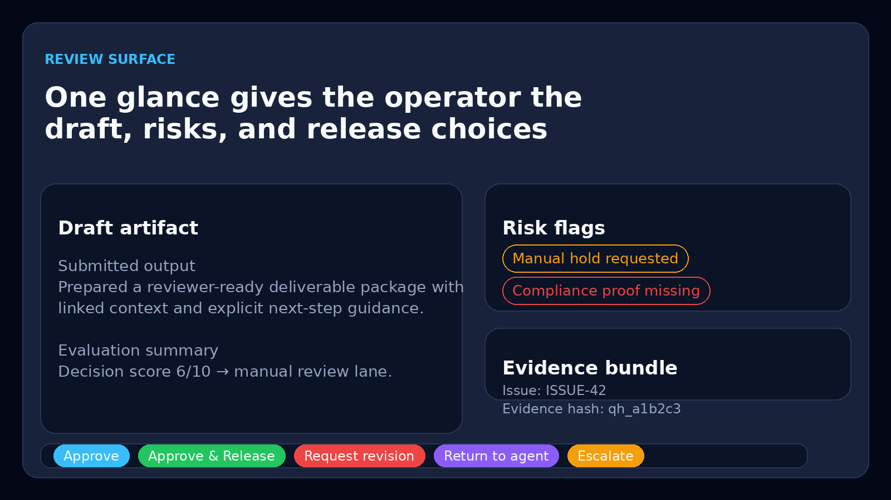
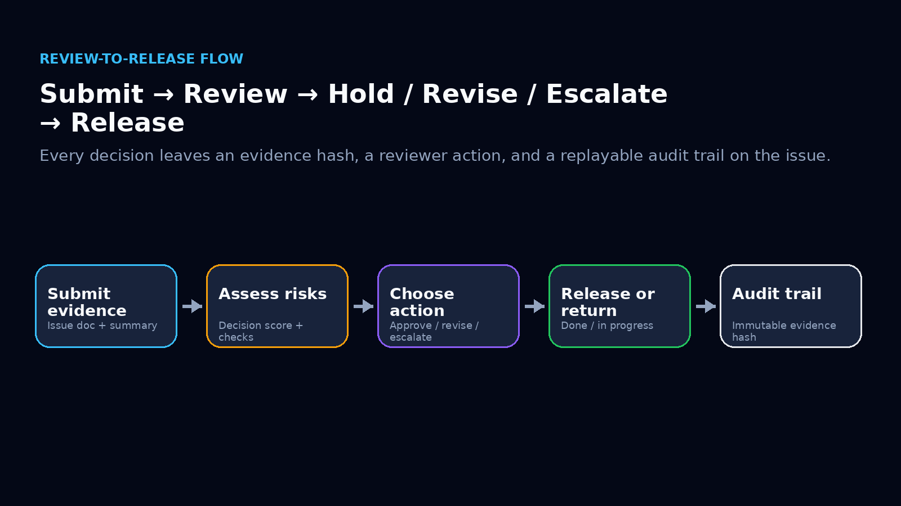

# UOS Quality Gate

Evidence-first human review for autonomous delivery inside Paperclip.

`uos-quality-gate` turns every agent deliverable into a reviewer-ready package with a draft artifact, risk flags, evidence refs, next-step guidance, and explicit release controls. Instead of a single pass/fail score, operators get a fast review surface with enough context to approve, hold, revise, return to agent, or escalate.



## Why teams buy this

Autonomous systems move fast, but the last mile still breaks on trust:

- reviewers cannot see why a draft was considered “done”
- evidence lives in comments, logs, and ad hoc chat threads
- release decisions are hard to reconstruct later
- operators need safe controls, not just another score

UOS Quality Gate fixes that by packaging every submission into an auditable review workbench that lives directly on the Paperclip issue.

## What it delivers

### 1. Evidence package per deliverable
Every review stores:

- triggering source and actor
- input references and retrieved issue context
- structured quality checks
- risk flags
- evidence hash
- next-step template
- reviewer action timeline

### 2. Operator-first review surface
Operators can:

- approve and release
- approve and hold
- request revision
- return work to the responsible agent
- escalate to a higher-scope reviewer
- regenerate next-step guidance



### 3. Auditability built into the workflow
The plugin persists issue-linked markdown artifacts for the evidence package and the next-step brief, so downstream teams can reconstruct what happened and why.

### 4. Company-level reviewer inbox
A dashboard widget and company page summarize queue pressure, review holds, released work, and high-risk packages so leads can triage the next decisions fast.

### 5. Paperclip-native integration
The plugin is built around the Paperclip plugin SDK and plugs into the host control plane through:

- events
- issue comments
- issue documents
- plugin state
- telemetry and metrics
- detail-tab UI
- agent tools

## Product positioning

This release reframes the project from a threshold-only gate into a reusable **human-in-the-loop review workbench**.

### Before
- score-only gating
- thin approval flow
- limited evidence and weak operator ergonomics

### Now
- structured evidence bundle
- decision score plus risk flags
- draft artifact + confidence signal
- reviewer timeline
- release, hold, revision, return, and escalation paths
- issue-linked evidence and next-step documents

## Core workflow



1. An operator or agent submits work for review.
2. The plugin evaluates the submission and builds the evidence package.
3. The reviewer sees draft, risks, checks, and trace context in one place.
4. The reviewer approves, holds, revises, returns, or escalates.
5. The final state is written back to the Paperclip issue and audit trail.

## Key capabilities in v2

### Actions

- `quality_gate.submit`
- `quality_gate.approve`
- `quality_gate.approve_hold`
- `quality_gate.reject`
- `quality_gate.assign`
- `quality_gate.return_to_agent`
- `quality_gate.escalate`
- `quality_gate.generate_next_step`
- `quality_gate.bulk_approve`
- `quality_gate.bulk_reject`

### Data

- `quality_gate.review`
- `quality_gate.reviews`
- `quality_gate.config`
- `quality_gate.trends`

### Tools

- `quality_gate_review`
- `submit_for_review`

### Event wiring

- auto-reacts to `agent.run.finished`
- logs `issue.created` and `issue.updated`
- emits review lifecycle stream events

## Architecture at a glance

- `src/helpers.ts` — pure review/evaluation logic
- `src/actions.ts` — operator actions and lifecycle mutations
- `src/events.ts` — Paperclip event subscriptions
- `src/shared.ts` — state, issue snapshot, observability, document persistence
- `src/tools.ts` — agent tools for submit/read flows
- `src/worker.ts` — plugin bootstrap and data registrations
- `src/ui/QualityGateTab.tsx` — reviewer cockpit tab
- `src/ui/settings.tsx` — threshold/settings view

For deeper technical detail, see:

- [SPEC.md](SPEC.md)
- [docs/architecture.md](docs/architecture.md)
- [docs/operator-guide.md](docs/operator-guide.md)
- [docs/operator-playbook.md](docs/operator-playbook.md)
- [docs/review-findings.md](docs/review-findings.md)

## Installation

This repository is currently configured as a private Paperclip plugin project.

```bash
git clone https://github.com/Ola-Turmo/uos-quality-gate.git
cd uos-quality-gate
npm ci
npm run plugin:typecheck
npm test
npm run plugin:build
```

Load the built plugin into your Paperclip environment according to your host/plugin deployment setup.

## Development

```bash
npm ci
npm run plugin:typecheck
npm test
npm run plugin:build
```

### Security audit

```bash
npm run security:audit
```

### Refresh marketing images

```bash
python3 scripts/generate-doc-images.py
```

## What is intentionally not in scope

This plugin is a review gate and operator workbench. It is **not**:

- a full outbound messaging engine
- a board-level universal chat client
- a Paperclip replacement control plane

Those capabilities can sit beside this plugin, but this repository focuses on the review gate between autonomous output and real-world release.

## Status

- Type-safe
- Test-covered for the core review builders
- Buildable with current Paperclip SDK
- Ready for self-hosted Paperclip workflows that need human review before release
