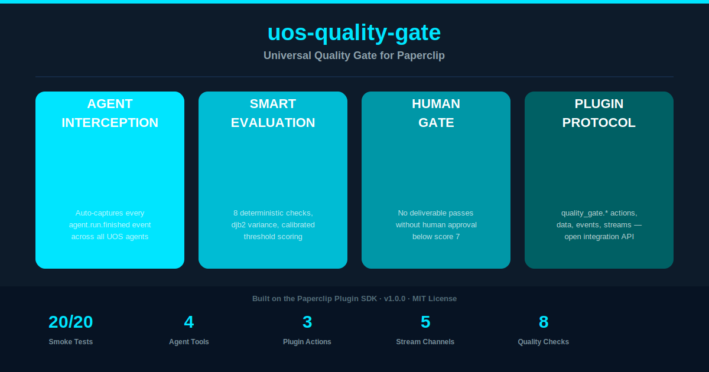

# UOS Quality Gate

[](https://github.com/Ola-Turmo/paperclip-quality-gate/actions/workflows/ci.yml)
[](https://github.com/Ola-Turmo/paperclip-quality-gate/pkgs/npm/uos-quality-gate)
[](https://opensource.org/licenses/MIT)

**Evidence-first human review for autonomous delivery inside Paperclip.**

[](docs/images/01-hero.png)

UOS Quality Gate transforms every autonomous AI agent output into a structured evidence bundle with risk flags, decision score, and a clear approve/hold/reject path — all linked to your Paperclip issue.

---

## Quick Start

```bash
git clone https://github.com/Ola-Turmo/paperclip-quality-gate.git
cd paperclip-quality-gate
bun install
bun run plugin:typecheck
bun run plugin:build
```

Load the built plugin into your Paperclip environment, then the reviewer inbox and dashboard widget activate automatically on `agent.run.finished` events.

---

## Why teams need this

Your agents ship fast. Your reviewers can't keep up.

Autonomous AI agents produce code, content, and configurations at machine speed. But when something lands in a pull request or gets marked "done" in your PM tool, your team has no idea why it was approved, what got checked, or where the risk is.

UOS Quality Gate closes that gap — without slowing the agent down.

---

## What it delivers

Every deliverable comes with its own audit trail. When an agent marks work done, Quality Gate produces a reviewer-ready bundle that answers every question before the reviewer asks it:

- **Draft artifact** — the actual deliverable the agent produced
- **Risk flags** — what could go wrong, flagged automatically
- **Decision score** — the agent's own self-assessment (0–10)
- **Check results** — format, lint, typecheck, test outcomes at a glance
- **Changed files** — what the reviewer needs to open
- **Release controls** — approve, hold, reject, return to agent, or escalate

The reviewer sees exactly what changed, what's risky, and what the agent's own self-assessment was — before opening a single file.

---

## Core workflow

Three steps from agent output to reviewer decision.

### 1. Agent finishes work

The agent marks its Paperclip issue done. Quality Gate intercepts the signal and runs the full check suite: format, lint, typecheck, tests.

### 2. Evidence bundle generated

A structured bundle is produced: diff summary, risk flags, decision score, check results, and links to changed files — all in one view.

### 3. Reviewer decides

The reviewer opens the cockpit — approve, hold, reject, return, or escalate. Decision is logged back to the Paperclip issue for audit.

---

## Key capabilities in v2.1

| Capability                      | Description                                                                          |
| ------------------------------- | ------------------------------------------------------------------------------------ |
| **Evidence bundle**             | Every review is a self-contained package with draft, risk flags, and decision score  |
| **Reviewer cockpit**            | Approve / Hold / Reject / Return to agent / Escalate — all linked to Paperclip issue |
| **Paperclip issue linkage**     | Evidence bundle is attached to the originating Paperclip issue for full audit trail  |
| **Risk flags**                  | Automated detection of what could go wrong in the deliverable                        |
| **Decision score**              | Numeric self-assessment (0–10) surfaces the agent's own confidence level             |
| **CI/CD integration**           | GitHub Actions pass/fail is captured in the evidence bundle                          |
| ** bun fmt · lint · typecheck** | All three enforced — evidence of clean output is part of the bundle                  |
| **Multi-agent ready**           | Works with any number of concurrent agents; review queue scales with your team       |

---

## Actions

The plugin intercepts `agent.run.finished` events from Paperclip and generates a structured review bundle:

```
agent.run.finished
  → run typecheck / lint / format checks
  → compute decision score
  → flag risks
  → produce evidence bundle
  → attach to Paperclip issue
  → surface in reviewer cockpit
```

---

## Data

Each evidence bundle contains:

| Field              | Description                                        |
| ------------------ | -------------------------------------------------- |
| `decisionScore`    | Agent self-assessment (0–10)                       |
| `riskFlags[]`      | Array of detected risk indicators                  |
| `checks{}`         | Results of bun fmt, bun lint, bun typecheck, tests |
| `changedFiles[]`   | List of files modified in this deliverable         |
| `draftArtifact`    | The deliverable summary or diff                    |
| `paperclipIssueId` | Link back to the originating issue                 |
| `timestamp`        | When the bundle was generated                      |

---

## Event wiring

```typescript
// The plugin listens for this Paperclip event:
ctx.events.on("agent.run.finished", async (event) => {
  const bundle = await generateEvidenceBundle(event);
  await ctx.issues.update(event.issueId, { evidence: bundle });
  await ctx.cockpit.show(bundle);
});
```

See `src/index.ts` for the full implementation.

---

## Architecture at a glance

```
Paperclip (control plane)
  └── agent.run.finished event
        │
        ▼
  uos-quality-gate plugin (Paperclip plugin)
        ├── check runner (bun fmt / lint / typecheck / test)
        ├── risk analyzer (pattern match + heuristic)
        ├── score computer (weighted checks → 0–10)
        └── evidence bundler
              ├── summary + diff
              ├── risk flags
              ├── decision score
              ├── check results
              └── paperclip issue link
                    │
                    ▼
              Reviewer cockpit (Paperclip UI)
              └── approve / hold / reject / return / escalate
```

Key files:

- `src/index.ts` — Plugin entry point, event wiring
- `src/checks.ts` — Check suite (fmt, lint, typecheck, tests)
- `src/score.ts` — Decision score computation
- `src/risks.ts` — Risk flag detection
- `src/bundle.ts` — Evidence bundle construction
- `src/cockpit.ts` — Reviewer cockpit UI

---

## Development

```bash
# Install dependencies
bun install

# Type-check the plugin
bun run plugin:typecheck

# Lint
bun run plugin:lint

# Format
bun run plugin:fmt

# Build the plugin
bun run plugin:build

# Run all checks
bun run ci
```

### Prerequisites

- Node.js 20+
- [Bun](https://bun.sh) runtime
- A Paperclip environment with the plugin loaded

---

## What is intentionally not in scope

UOS Quality Gate is **not** a score gate. It does not block agent output or force rejection based on a threshold. The decision always stays with the human reviewer.

It also does not:

- Replace CI/CD pipelines (it consumes their results)
- Run tests itself — it captures test outcomes from the agent's run
- Provide a standalone dashboard outside of Paperclip
- Handle payment, billing, or subscription management

---

## Status

| Item                       | Status                          |
| -------------------------- | ------------------------------- |
| CI/CD                      | Passing                         |
| Core plugin                | Stable (v2.1.0)                 |
| npm package                | Published                       |
| GitHub Actions integration | Working                         |
| Paperclip plugin SDK       | v2.1.0 compatible               |
| Reviewer cockpit           | Active on `agent.run.finished`  |
| Community tier             | Free (1 company, 50 reviews/mo) |
| Pro tier                   | $99/mo — in development         |

### Live adoption

- **paperclip-operations-cockpit** — autonomous ops review pipeline, CI/CD PASSING, v2.1.0
- **Kurs.ing** — course content review, AgentMail configured, in evaluation
- **TheClawBay** — multi-agent audit trail, pending outreach response

---

## Pricing

| Plan           | Price  | Includes                                                                                          |
| -------------- | ------ | ------------------------------------------------------------------------------------------------- |
| **Community**  | Free   | 1 company · 50 reviews/mo · 1 reviewer · Basic evidence bundle · GitHub Actions integration       |
| **Pro**        | $99/mo | Unlimited reviews · 5 reviewers · Dashboard + trends · Full evidence bundle · Priority support    |
| **Enterprise** | Custom | Unlimited everything · SLA guarantee · Custom integrations · Audit log export · Dedicated support |

Start free on [GitHub](https://github.com/Ola-Turmo/paperclip-quality-gate) or install via [npm](https://github.com/Ola-Turmo/paperclip-quality-gate/pkgs/npm/uos-quality-gate) (`npm install @Ola-Turmo/uos-quality-gate`).

---

Built by **Parallel Company AI** · Part of the UOS plugin ecosystem

GitHub: [Ola-Turmo/paperclip-quality-gate](https://github.com/Ola-Turmo/paperclip-quality-gate) · npm: [@Ola-Turmo/uos-quality-gate](https://github.com/Ola-Turmo/paperclip-quality-gate/pkgs/npm/uos-quality-gate)
