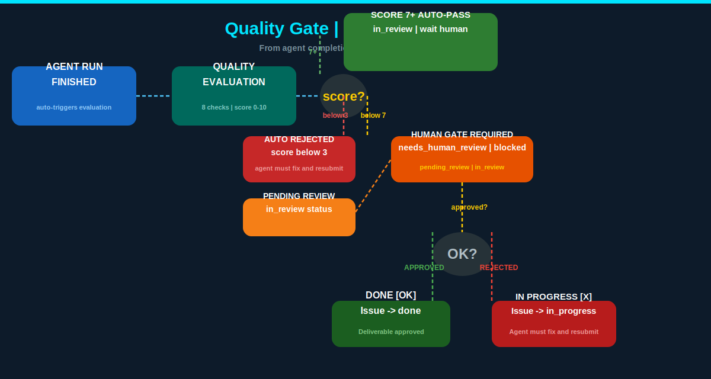
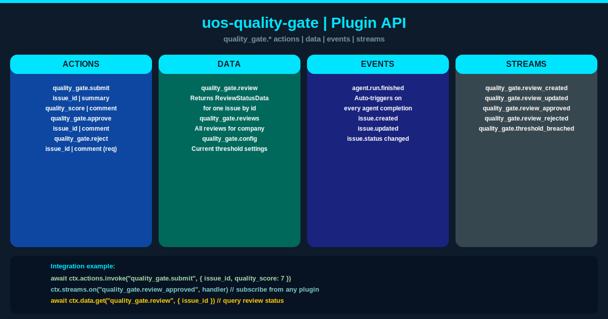

# uos-quality-gate

> **Universal Quality Gate for the UOS ecosystem.**
> Auto-intercepts every agent completion. Scores quality. Enforces human approval before work is marked `done`.

[](https://opensource.org/licenses/MIT)
[](https://www.paperclip.ai)

---

## What does this do?

No more shipping bad work by accident.

`uos-quality-gate` is a zero-coupling quality enforcement layer that sits between your UOS agents and your issue tracker. Every completed deliverable is automatically scored, triaged, and held at a human review gate — until a reviewer says *yes* or *no*.

**If an agent scores 7 or above**, it enters review. **If it scores below 3**, it's auto-rejected and sent back. **If it lands in between**, a human decides. Nothing slips through unmarked.

---

## Why you need this

| Problem | Without quality gate | With uos-quality-gate |
|---|---|---|
| Agent ships low-quality output | Immediately merged | Auto-rejected, agent fixes it |
| No visibility into agent output quality | Blind handoff | Live score + check breakdown |
| Reviews bottleneck on one person | Missed deadlines | Distributed review queue |
| Other plugins can't see quality state | Tight coupling | Open `quality_gate.*` protocol |

---



## How it works

Every `agent.run.finished` event triggers a deterministic quality evaluation:

```
score 7+   → AUTO-PASS     → in_review, wait human
score 3-6  → HUMAN GATE    → needs_human_review, blocked
score < 3  → AUTO-REJECT   → in_progress, agent must fix & resubmit
```

The score uses 8 calibrated checks with a djb2-hashed ±1 variance — so results are deterministic per issue, never random. The exact threshold values are configurable per deployment.

---

## Integration example

Any UOS plugin can invoke, subscribe, or query:

```typescript
// Submit a deliverable for review
const result = await ctx.actions.invoke("quality_gate.submit", {
  issue_id: "iss_xxxx",
  summary: "Implemented user auth",
  quality_score: 7,
  block_approval: false,
});

// Subscribe to approvals from any plugin
ctx.streams.on("quality_gate.review_approved", async ({ review }) => {
  ctx.logger.info("Deliverable approved", { issueId: review.issueId });
});

// Query review status
const data = await ctx.data.get("quality_gate.review", { issueId: "iss_xxxx" });
```

---

## Plugin API



---

## Configuration

Deploy with custom thresholds:

```json
{
  "minQualityScore": 7,
  "blockThreshold": 5,
  "autoRejectBelow": 3
}
```

| Parameter | Default | Effect |
|---|---|---|
| `minQualityScore` | `7` | Score above this + no blockers → auto-pass |
| `blockThreshold` | `5` | Score at or below this → requires human review |
| `autoRejectBelow` | `3` | Score below this → auto-rejected, agent must fix |

---

## Feature overview


---

## Development

```bash
npm install
npm run plugin:typecheck   # Type check (0 errors)
npm test                    # Smoke tests (20/20 passing)
npm run plugin:build        # Production build
npm run plugin:dev          # Watch mode
```

---

## Architecture

```
src/
├── manifest.ts          — Plugin manifest, capabilities, tool declarations
├── worker.ts            — Plugin worker (actions, tools, events, streams)
├── types.ts             — TypeScript interfaces
├── helpers.ts           — Pure evaluation logic
└── ui/
    ├── index.tsx         — UI entry point
    └── QualityGateTab.tsx — Issue detail review panel
```

---

## Protocol versioning

All public surfaces (`quality_gate.*` actions, data, events, streams) are the public API. Breaking changes require a major version bump + migration guide. From v1.0.0, this is the stable surface.

---

## License

MIT — [turmo.dev](https://turmo.dev)
